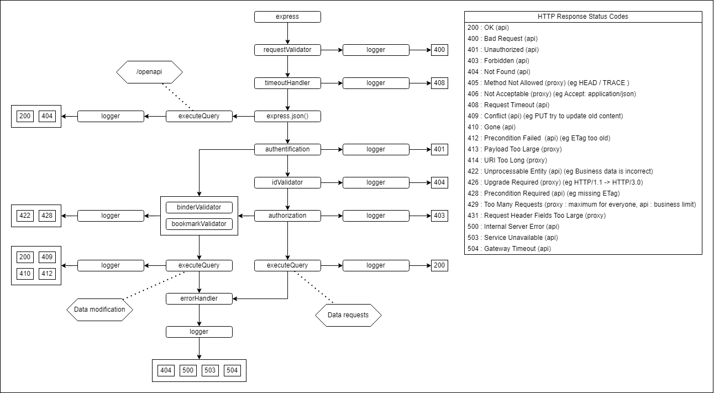

# Marquepage 

Marquepage is a tool to Synchronize bookmarks between browsers and share them with others. Bookmarks are stored in a 'binder' and each binder will be a subfolder in your favorites

## Planned features

- Synchronize bookmarks between browsers
- The bookmarks will be saved in a subfolder
- Your saved bookmarks will not be affected
- Cross browser compatibility with extensions
- Share your bookmarks with people with a simple link
- Access control lists, client side encryption, and more 

## Application architecture : global

Marquepage will work as an extension in the browser. The extension will call an API build on NodeJS and MongoDB.

## Application architecture : express

Different express middleware flows and errors handling

